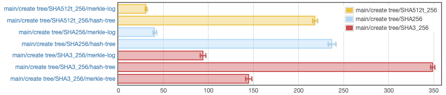
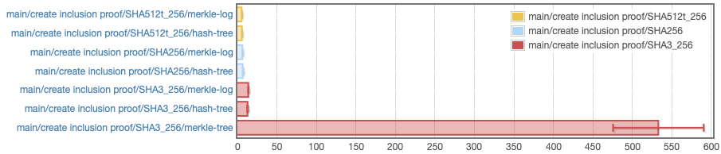
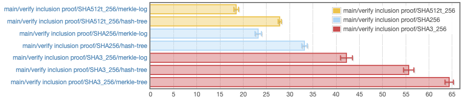

# Haskell Implementation of Merkle Tree Logs

This packages implements Merkle Tree Logs as described in RFC 6962 in Haskell.

## Format

The implementation stores Merkle trees in a packed format in memory. This allows
for efficient construction, serialization, and querying. Trees are opaque
objects that are allocated and deallocated as well as serialized and
deserialized as a whole, which matches many use cases. Also, trees can be easily
nested, by building larger Merkle trees that have smaller trees as inputs to
their leafs.

The overhead per indexed item is 64 bytes when 256 bit hashes are used. Thus,
about 16,000 items can be index in 1MB of memory.

We plan to make the trees extensible and support loading and storing trees in
chunks that represent immutable full subtrees. Please file an issue on GitHub if
you need this feature.

## Proofs

Proofs are self contained and don't rely on a particular implementation of
Merkle tree. In particular, proofs don't depend on how the tree is balanced.

A proof contains the proof subject (the input for which inclusion is proven) as
a plain `ByteString`. The result of validating a proof is a Merkle tree root
that must match the root of the Merkle tree that includes the subject. A proof
doesn't include the root hash of the Merkle tree, because the root must be
obtained from a trusted / authenticated source. Including it in the proof would
thus be redundant and may even be misleading.

At the moment only inclusion / audit proofs are supported. We plan to also
implement consistency proofs. Please file an issue on GitHub if you need
consistency proofs.

## Build and Installation

The package can be build with cabal via

```sh
cabal new-update
cabal new-build merkle-log
```

The test suite can be run with

```sh
cabal new-test merkle-log
```

Benchmarks are available via


```sh
cabal new-bench merkle-log
```

## Benchmarks

The following benchmark results compare the performance of this package with
the Merkle tree implementations in the packages
[merkle-tree](http://hackage.haskell.org/package/merkle-tree) and
[hash-tree](http://hackage.haskell.org/package/hash-tree) for different hash
functions on a 64bit Intel CPU.

Create tree:



Create inclusion proof:



Verify inclusion proof:



